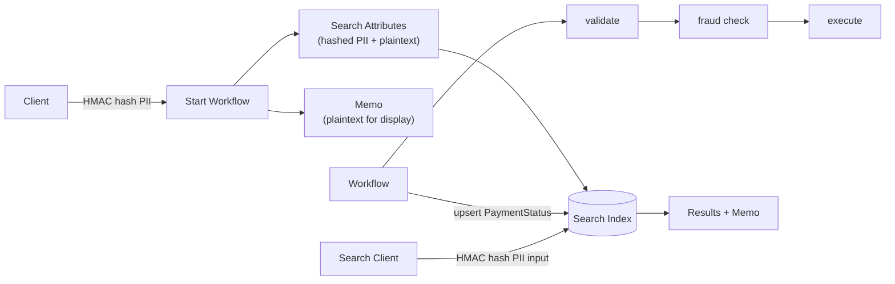

# Hashed Search Attributes

Demonstrates starting Temporal workflows with custom search attributes where PII fields (email, name) are HMAC-SHA256 hashed before indexing, while non-PII fields (payment ID, amount, status) are stored in plaintext. Plaintext values are stored in workflow memo for display after search. Memo fields are encrypted when worker is configured with an encryption Data Converter, so PII in memo is protected in storage while remaining readable by authorized clients.

## Flow



## Why HMAC hash?

- **Privacy**: PII is never stored in plaintext in the Temporal visibility store
- **Searchable**: HMAC is deterministic — the same input always produces the same hash, enabling exact-match lookups
- **Secure**: Without the HMAC secret key, the hashed values cannot be reversed or brute-forced efficiently

## Prerequisites

Register custom search attributes:

```bash
temporal operator search-attribute create --name HashedEmail --type Keyword
temporal operator search-attribute create --name HashedName --type Keyword
temporal operator search-attribute create --name PaymentId --type Keyword
temporal operator search-attribute create --name PaymentStatus --type Keyword
temporal operator search-attribute create --name PaymentAmount --type Double
```

## Usage

```bash
npm install

# Start the worker
npm start

# Start 5 payment workflows with different identities and amounts
npm run workflow
```

### Search by single attribute

```bash
# Search by email (HMAC hashed automatically)
npm run search -- --email alice@example.com

# Search by name (HMAC hashed automatically)
npm run search -- --name Bob Smith

# Search by payment status
npm run search -- --status COMPLETED

# Search by minimum dollar amount
npm run search -- --min-amount 500

# Search by payment ID
npm run search -- --payment-id PAY-xxxxx
```

### Complex queries combining search attributes

Use `--query` to pass a raw [Temporal visibility query](https://docs.temporal.io/visibility#list-filter) combining multiple attributes with `AND`/`OR`:

```bash
# All completed payments >= $500
npm run search -- --query 'PaymentAmount >= 500 AND PaymentStatus = "COMPLETED"'

# Alice's payments over $1000
HASH=$(npx ts-node -e "import{hmacHash}from'./src/crypto';console.log(hmacHash('alice@example.com'))")
npm run search -- --query "HashedEmail = \"${HASH}\" AND PaymentAmount >= 1000"

# Bob's completed payments
HASH=$(npx ts-node -e "import{hmacHash}from'./src/crypto';console.log(hmacHash('Bob Smith'))")
npm run search -- --query "HashedName = \"${HASH}\" AND PaymentStatus = \"COMPLETED\""

# Large payments that are still processing
npm run search -- --query 'PaymentAmount >= 1000 AND PaymentStatus != "COMPLETED"'
```

### Sample output

```
$ npm run search -- --min-amount 500

Searching for payments >= $500

  Workflow ID: payment-xTJZNxQe2vSZtgSpWu2CP
    Status:     COMPLETED
    Email:      bob@example.com
    Name:       Bob Smith
    Payment ID: PAY-o2khVXRL33EcLEdxfQdAr
    Amount:     $750

  Workflow ID: payment-BelJo9yyTeR7Nt2cmMkY5
    Status:     COMPLETED
    Email:      alice@example.com
    Name:       Alice Johnson
    Payment ID: PAY-4S_MlULqlc4q0HzsTrReC
    Amount:     $1200

  Workflow ID: payment-1kkBHcr2TR1DJcS5ftkVr
    Status:     COMPLETED
    Email:      bob@example.com
    Name:       Bob Smith
    Payment ID: PAY-88Imu2GQII2Te9nP1IHjT
    Amount:     $500

3 workflow(s) found.
```

## Search Attributes

| Attribute | Type | Hashed | Description |
|-----------|------|--------|-------------|
| `HashedEmail` | Keyword | Yes | HMAC-SHA256 of the email address |
| `HashedName` | Keyword | Yes | HMAC-SHA256 of the full name |
| `PaymentId` | Keyword | No | Payment identifier |
| `PaymentStatus` | Keyword | No | Updated after each activity: `PENDING` → `VALIDATING` → `FRAUD_CHECK` → `EXECUTING` → `COMPLETED` |
| `PaymentAmount` | Double | No | Dollar amount, supports range queries (`>=`, `<=`, `BETWEEN`) |

## Project Structure

| File | Description |
|------|-------------|
| `src/crypto.ts` | Shared `hmacHash()` — HMAC-SHA256, normalizes input to lowercase + trim |
| `src/workflows.ts` | `paymentWorkflow` — validates, fraud checks, executes; upserts `PaymentStatus` after each step |
| `src/activities.ts` | `validatePayment`, `fraudCheck`, `executePayment` |
| `src/client.ts` | Starts 5 workflows with different identities and amounts |
| `src/search-client.ts` | Searches by hashed PII, plaintext attributes, or raw visibility queries; displays memo |
| `src/worker.ts` | Worker listening on `search-attributes` task queue |

## Configuration

Set `HMAC_SECRET_KEY` environment variable to use a custom HMAC key. A default development key is used if not set.
